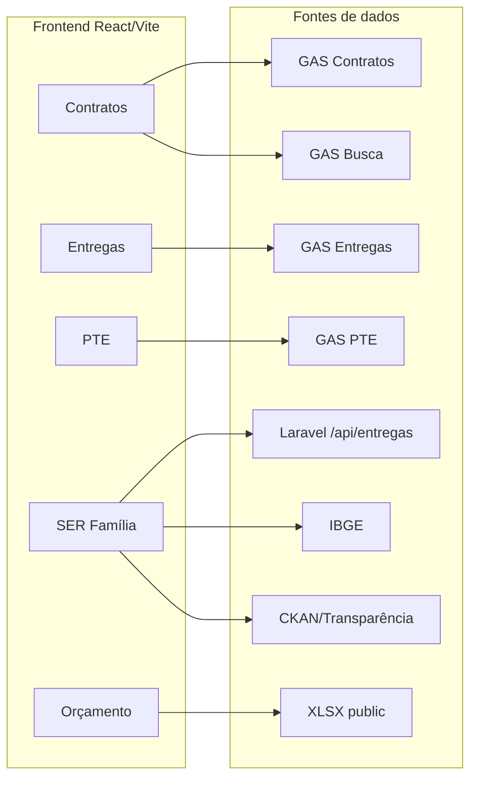

# Sistema SETASC – Painéis e Gestão

Painel unificado para a **SETASC** (Secretaria de Estado de Assistência Social e Cidadania – MT), reunindo Contratos, Entregas, PTE (Plano de Trabalho e Entregas), SER Família e Orçamento. Os dados vêm de **Google Sheets** (via Google Apps Script), **API Laravel**, **IBGE** e planilhas locais (XLSX).

---

## Stack tecnológica

- **Frontend:** React 19, TypeScript, Vite 5
- **UI:** Tailwind CSS, shadcn/ui (Radix), Framer Motion, Recharts, React Leaflet
- **Roteamento:** React Router DOM v6
- **Dados:** TanStack Query, Axios; leitura de XLSX (biblioteca `xlsx`) no cliente
- **Outros:** react-hook-form + Zod, jsPDF (relatórios em PDF), date-fns

---

## Estrutura do projeto

```
src/app/
├── components/       # Layout, Sidebar, Header, UI (shadcn)
├── lib/
│   └── api.ts        # Cliente Axios para busca inteligente (Contratos)
├── modules/          # Um subdiretório por área
│   ├── contratos/   # pages/, hooks/, components/
│   ├── entregas/
│   ├── pte/
│   ├── serfamilia/
│   ├── orcamento/
│   └── shared/
├── pages/            # Páginas globais (ex.: AdjuntaEmConstrucao)
└── data/             # Dados estáticos (ex.: contratos.json)

public/               # Estáticos e XLSX
└── orcamento_fiplan_setasc.xlsx   # Usado pelo módulo Orçamento
```

---

## Módulos e rotas

| Módulo      | Rotas principais | Fonte de dados principal |
|-------------|------------------|---------------------------|
| Contratos   | `/contratos`, `/contratos/lista`, `/contratos/:id`, `/contratos/relatorios`, `/contratos/gerenciamento` | Google Apps Script (GAS) |
| Entregas    | `/entregas`, `/entregas/detalhes` | Google Apps Script |
| PTE         | `/pte`, `/pte/planos`, `/pte/entregas`, etc. | Google Apps Script |
| SER Família | `/serfamilia` | API Laravel + IBGE + opcional CKAN/Transparência |
| Orçamento   | `/orcamento`, `/orcamento/lista`, `/orcamento/:id` | Arquivo XLSX em `public/` |

Referência completa de rotas: `src/App.tsx`.

---

## APIs e fontes de dados

### Google Apps Script (GAS)

Os endpoints são URLs de **Web App** do Google (tipicamente ligadas a planilhas). O frontend chama direto pelo navegador (CORS permitido pelo GAS). As URLs estão definidas nos respectivos hooks.

- **Contratos (lista e detalhe)**  
  - `src/app/modules/contratos/hooks/useContratos.tsx`: `API_BASE` próprio.  
  - Retorna lista de contratos (index) e, com `?contrato=...`, detalhe (cabeçalho, aditivos, lotes, empenhos, pagamentos).

- **Busca inteligente (Contratos)**  
  - `src/app/modules/contratos/hooks/useBuscaInteligente.tsx` usa `src/app/lib/api.ts` (outra URL GAS). Parâmetro `q` para busca.

- **Entregas**  
  - `src/app/modules/entregas/hooks/useEntregas.ts`: `GAS_BASE` – lista de entregas (rows), com suporte a chunking.

- **PTE**  
  - `src/app/modules/pte/hooks/usePTE.tsx`: `GAS_BASE` – projetos PTE (fases, modalidade, valores, etc.).

### API Laravel (SER Família)

- `src/app/modules/serfamilia/hooks/useSerfamilia.tsx`: `API_URL = "/api/entregas"`.
- Em produção o nginx deve fazer proxy de `/api/entregas` para o backend Laravel.
- Retorna dados de programas/cidades/anos para o painel SER Família (ex.: `?all=1` para carregar tudo).

### IBGE (público)

- `src/app/modules/serfamilia/hooks/useIBGE.tsx`:
  - Lista de municípios: `servicodados.ibge.gov.br/api/v1/localidades/estados/51/municipios` (51 = MT).
  - Agregados (população, PIB, densidade, etc.): `servicodados.ibge.gov.br/api/v3/agregados/...` (MT = N3[51]).
- Usado para enriquecer o SER Família com dados por município/estado.

### Dados sociais (opcional – SER Família)

- `src/app/modules/serfamilia/hooks/useSociais.ts`:
  - **CKAN:** `host/api/3/action/datastore_search` (ex.: dados.mds.gov.br, dados.gov.br) com `resource_id`.
  - **Portal da Transparência:** requisições com header `chave-api-dados` (token).
- Retorna contagens (famílias CadÚnico, CRAS, CREAS, Bolsa Família, BPC, etc.) por município/ano.

### Orçamento (arquivo estático)

- `src/app/modules/orcamento/hooks/useOrcamentoLocal.ts` e `src/app/modules/orcamento/pages/Detalhes.tsx`:
  - `fetch("/orcamento_fiplan_setasc.xlsx")` → arquivo em `public/orcamento_fiplan_setasc.xlsx`.
  - Leitura no cliente com a biblioteca `xlsx`; aba **FIPLAN**.
  - Colunas: UO, Ano, Orçado Inicial/Atual, Empenhado, Liquidado, Pago.

### Fluxo de dados (resumo)



---

## Variáveis de ambiente

Crie um arquivo `.env` na raiz do projeto (não commitar com valores sensíveis em produção):

| Variável | Descrição |
|----------|-----------|
| `VITE_API_URL` | URL do backend (ex.: `http://82.29.59.209:8083`) – usado onde o front chama API própria. |
| `NEXT_PUBLIC_API_BASE_URL` | Base da API pública (ex.: `https://setasc.blucaju.com.br`). |

As URLs dos Google Apps Script estão definidas nos hooks (`useContratos.tsx`, `useEntregas.ts`, `usePTE.tsx`, `lib/api.ts`). No futuro podem ser centralizadas em variáveis de ambiente.

---

## Como rodar o projeto

**Pré-requisitos:** Node.js 18+, npm (ou bun).

```sh
# Instalar dependências
npm install

# Desenvolvimento (Vite)
npm run dev

# Build de produção
npm run build

# Preview do build (porta 3002)
npm run start
# ou
npm run preview
```

---

## Observações

- **Contratos:** há dois endpoints GAS – um para lista/detalhe (`useContratos`) e outro para busca inteligente (`lib/api.ts` + `useBuscaInteligente`).
- **SER Família:** em produção, configurar proxy (nginx) de `/api/entregas` para o backend Laravel.
- **Orçamento:** ao atualizar a planilha FIPLAN, substituir o arquivo `public/orcamento_fiplan_setasc.xlsx`.
